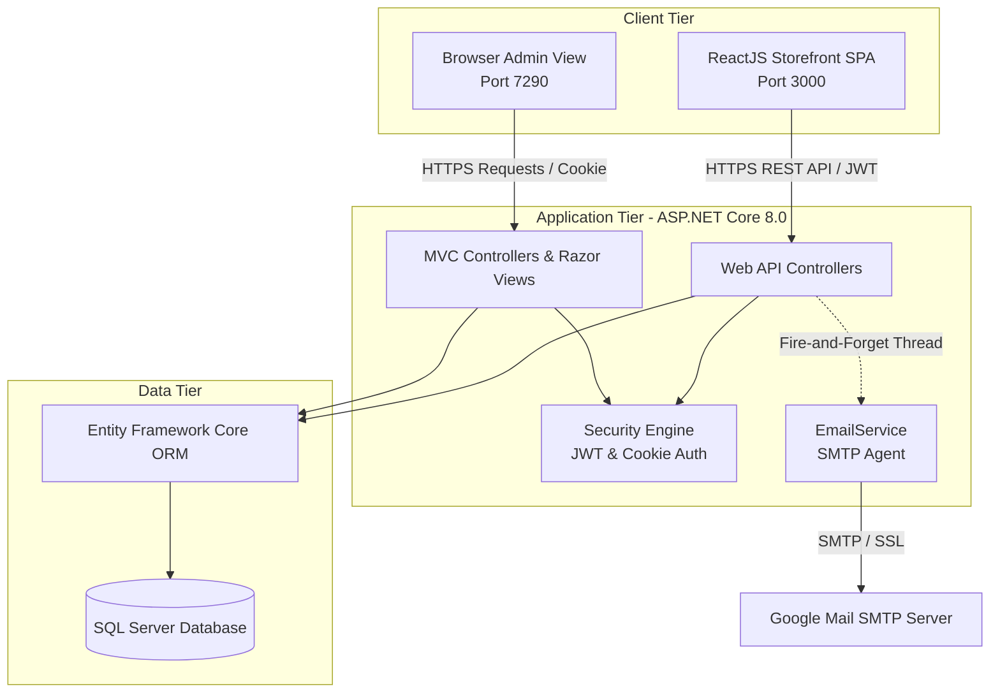
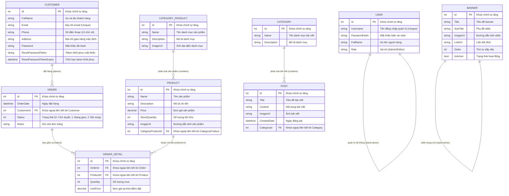
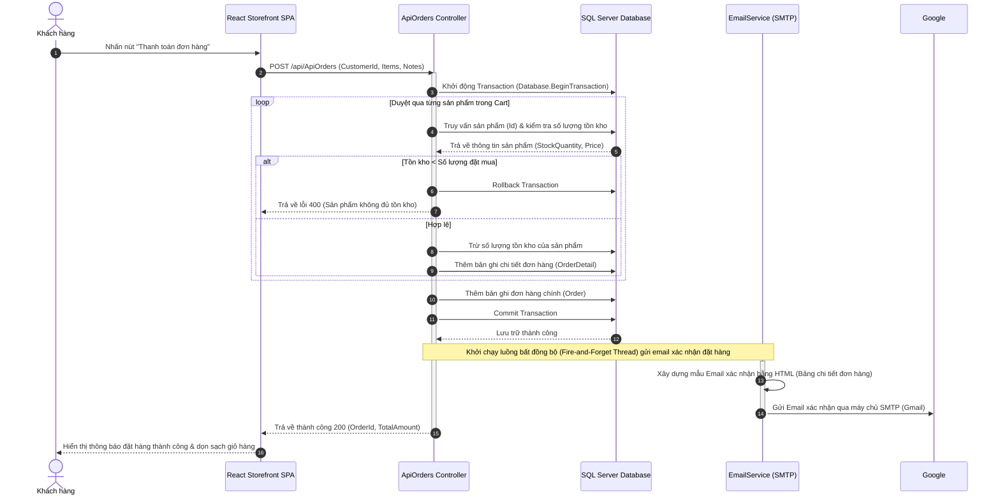

# HuyCMS_Solution - CMS & E-commerce System (Bakery House)

Dự án **HuyCMS_Solution** là một hệ thống quản lý nội dung (CMS) tích hợp tính năng bán lẻ trực tuyến (E-commerce), được thiết kế đặc thù cho thương hiệu cửa hàng bánh ngọt **Bakery House**. Hệ thống được xây dựng theo kiến trúc tách biệt hiện đại (Decoupled Architecture), bao gồm **Backend RESTful API & Admin Dashboard Portal (ASP.NET Core)** và **Client Storefront (ReactJS Single Page Application)**.

---

## 👨‍💻 Thông tin tác giả
* **Sinh viên**: Phạm Thanh Huy
* **Mã sinh viên**: 2122110384
* **Lớp**: CCQ2211J
* **Ngày tạo**: 16/05/2026
* **Phiên bản**: 2.0 (Bản hoàn thiện đầy đủ)

---

## 🏗️ Kiến trúc hệ thống (System Architecture)

Hệ thống được tổ chức thành 3 tầng chức năng chính kết nối qua môi trường mạng bằng giao thức HTTPS:
1. **Client Storefront (ReactJS SPA)**: Giao diện trực quan phía người tiêu dùng để lướt xem sản phẩm, đọc tin tức, đặt hàng và quản lý tài khoản cá nhân.
2. **Admin Portal & API Service (ASP.NET Core)**:
   - **Admin Portal (MVC)**: Cung cấp giao diện quản trị viên (Back-office) thông qua mô hình Server-side rendering (Razor Views).
   - **RESTful API Engine**: Cung cấp các Endpoint JSON phục vụ dữ liệu cho ứng dụng ReactJS SPA.
3. **Database (SQL Server)**: Lưu trữ toàn bộ dữ liệu quan hệ của hệ thống thông qua Entity Framework Core làm tầng trung gian ORM.



---

## 💡 Các chức năng nổi bật của dự án

### 🛍️ 1. Client Storefront (Dành cho Khách hàng - ReactJS)
* **Trang chủ động**: Hiển thị slide banner động được cấu hình từ admin, danh mục sản phẩm nổi bật, danh sách sản phẩm mới nhất và các sản phẩm bán chạy nhất.
* **Cửa hàng & Bộ lọc sản phẩm**: Duyệt danh sách sản phẩm, lọc theo danh mục (`CategoryProduct`) và lọc theo khoảng giá tối thiểu/tối đa linh hoạt.
* **Tìm kiếm thời gian thực**: Tìm kiếm sản phẩm theo tên hoặc nội dung mô tả ngay trên thanh điều hướng.
* **Trang tin tức/Blog**: Hiển thị các bài viết chia sẻ theo từng chủ đề danh mục tin tức (`Category`).
* **Giỏ hàng & Thanh toán (Cart & Checkout)**: 
  - Lưu trữ trạng thái giỏ hàng local.
  - Form điền thông tin đặt hàng, ghi chú đơn hàng.
  - Tự động kiểm tra số lượng tồn kho trước khi thanh toán.
* **Hồ sơ cá nhân & Đơn hàng**:
  - Đăng ký tài khoản, đăng nhập xác thực qua Token JWT.
  - Xem thông tin cá nhân và cập nhật thông tin (Họ tên, Điện thoại, Địa chỉ, Email).
  - Đổi mật khẩu bảo mật.
  - Quên mật khẩu và tự động khôi phục, nhận mật khẩu mới qua Email.
  - Xem lịch sử đơn hàng đã mua và chi tiết từng đơn hàng.

### ⚙️ 2. Admin Portal (Dành cho Quản trị viên - ASP.NET Core MVC)
* **Bảng điều khiển thông tin (Dashboard)**:
  - Thống kê tổng số lượng sản phẩm, bài viết, khách hàng, đơn hàng.
  - Thống kê chi tiết đơn hàng theo trạng thái (Chờ duyệt, Đang giao, Đã giao).
  - Biểu đồ thống kê doanh thu 7 ngày gần nhất sử dụng **Chart.js**.
  - Biểu đồ trực quan Top 5 sản phẩm bán chạy nhất.
  - Danh sách cảnh báo sản phẩm sắp hết hàng (tồn kho < 10) và đơn hàng mới nhất.
* **Hệ thống thông báo thông minh**: 
  - Biểu tượng quả chuông cập nhật thời gian thực các sự kiện: có đơn hàng mới trong 24h qua, cảnh báo sản phẩm sắp hết hàng, bài viết mới đăng tải.
* **Tìm kiếm toàn cục (Global Admin Search)**: Tìm kiếm đồng thời Đơn hàng, Sản phẩm, Bài viết và Khách hàng trên một ô tìm kiếm duy nhất.
* **Quản lý phân hệ CRUD hoàn chỉnh**:
  - **Sản phẩm & Danh mục**: Thêm, sửa, xóa sản phẩm kèm tính năng tải lên ảnh thực tế.
  - **Bài viết & Chủ đề**: Quản lý tin tức bài viết đính kèm hình ảnh.
  - **Quản lý Banner**: Cấu hình slide ảnh trang chủ, thứ tự hiển thị, liên kết và trạng thái hoạt động.
  - **Quản lý Đơn hàng**: Tiếp nhận đơn hàng, thay đổi trạng thái đơn hàng (Chờ duyệt -> Đang giao -> Đã xong). Tự động cập nhật tồn kho tương ứng.
  - **Quản lý Người dùng**: Phân cấp tài khoản Admin / Editor để quản lý hệ thống.

---

## 📊 Sơ đồ quan hệ thực thể (Entity Relationship Diagram - ERD)

Dưới đây là sơ đồ chi tiết biểu diễn các thực thể dữ liệu và mối quan hệ của chúng trong cơ sở dữ liệu `HuyCMS_DB`:



---

## 🗃️ Thiết kế chi tiết các bảng dữ liệu (Database Schema)

Dưới đây là chi tiết cấu trúc các bảng trong cơ sở dữ liệu `HuyCMS_DB` được định nghĩa trong dự án `CMS.Data`:

### 1. Bảng `Users` (Quản trị viên)
Lưu trữ thông tin các tài khoản có quyền truy cập vào trang Admin Dashboard.

| Tên trường (Column) | Kiểu dữ liệu (Type) | Ràng buộc (Constraints) | Mô tả (Description) |
| :--- | :--- | :--- | :--- |
| **Id** | `int` | Primary Key, Identity | Mã định danh quản trị viên |
| **Username** | `nvarchar(max)` | Required | Tên tài khoản đăng nhập |
| **PasswordHash** | `nvarchar(max)` | Required | Mật khẩu đã mã hóa |
| **FullName** | `nvarchar(max)` | Required | Họ và tên đầy đủ |
| **Role** | `nvarchar(max)` | Required | Vai trò trong hệ thống (`Admin`, `Editor`) |

### 2. Bảng `Customers` (Khách hàng)
Lưu trữ tài khoản của người mua sắm đăng ký qua ứng dụng ReactJS Storefront.

| Tên trường (Column) | Kiểu dữ liệu (Type) | Ràng buộc (Constraints) | Mô tả (Description) |
| :--- | :--- | :--- | :--- |
| **Id** | `int` | Primary Key, Identity | Mã định danh khách hàng |
| **FullName** | `nvarchar(max)` | Required | Họ và tên khách hàng |
| **Email** | `nvarchar(max)` | Required, EmailAddress | Email (tài khoản đăng nhập) |
| **Phone** | `nvarchar(max)` | Regex 10 chữ số | Số điện thoại liên hệ |
| **Address** | `nvarchar(max)` | Nullable | Địa chỉ nhận hàng mặc định |
| **Password** | `nvarchar(max)` | Required | Mật khẩu đã băm (`BCrypt`) |
| **ResetPasswordToken** | `nvarchar(max)` | Nullable | Token tạm dùng khi quên mật khẩu |
| **ResetPasswordTokenExpiry**| `datetime2` | Nullable | Thời gian hết hạn của Reset Token |

### 3. Bảng `CategoriesProducts` (Danh mục sản phẩm)
Phân loại sản phẩm bánh ngọt (ví dụ: Bánh mỳ, Bánh ngọt, Bánh kem, Đồ uống...).

| Tên trường (Column) | Kiểu dữ liệu (Type) | Ràng buộc (Constraints) | Mô tả (Description) |
| :--- | :--- | :--- | :--- |
| **Id** | `int` | Primary Key, Identity | Mã danh mục sản phẩm |
| **Name** | `nvarchar(100)` | Required | Tên danh mục sản phẩm |
| **Description** | `nvarchar(max)` | Nullable | Mô tả ngắn về danh mục |
| **ImageUrl** | `nvarchar(max)` | Nullable | Hình ảnh đại diện cho danh mục |

### 4. Bảng `Products` (Sản phẩm)
Thông tin các loại bánh và sản phẩm kinh doanh tại tiệm.

| Tên trường (Column) | Kiểu dữ liệu (Type) | Ràng buộc (Constraints) | Mô tả (Description) |
| :--- | :--- | :--- | :--- |
| **Id** | `int` | Primary Key, Identity | Mã sản phẩm |
| **Name** | `nvarchar(max)` | Required | Tên sản phẩm |
| **Description** | `nvarchar(max)` | Nullable | Mô tả chi tiết thành phần, hương vị |
| **Price** | `decimal(18,2)` | Range >= 0 | Đơn giá sản phẩm |
| **StockQuantity** | `int` | Required | Số lượng sản phẩm hiện có trong kho |
| **ImageUrl** | `nvarchar(max)` | Nullable | Đường dẫn hình ảnh sản phẩm |
| **CategoryProductId** | `int` | Foreign Key (CategoriesProducts) | Liên kết tới danh mục sản phẩm |

### 5. Bảng `Orders` (Đơn hàng)
Quản lý trạng thái thông tin mua hàng tổng quan của khách hàng.

| Tên trường (Column) | Kiểu dữ liệu (Type) | Ràng buộc (Constraints) | Mô tả (Description) |
| :--- | :--- | :--- | :--- |
| **Id** | `int` | Primary Key, Identity | Mã đơn hàng |
| **OrderDate** | `datetime2` | Default: `DateTime.Now` | Thời gian đặt hàng |
| **CustomerId** | `int` | Foreign Key (Customers) | Người thực hiện đơn hàng |
| **Status** | `int` | Required | Trạng thái (`0`: Chờ duyệt, `1`: Đang giao, `2`: Đã xong) |
| **Notes** | `nvarchar(max)` | Nullable | Ghi chú vận chuyển của khách |

### 6. Bảng `OrderDetails` (Chi tiết đơn hàng)
Lưu thông tin chi tiết từng sản phẩm được mua trong đơn hàng đó.

| Tên trường (Column) | Kiểu dữ liệu (Type) | Ràng buộc (Constraints) | Mô tả (Description) |
| :--- | :--- | :--- | :--- |
| **Id** | `int` | Primary Key, Identity | Mã chi tiết đơn hàng |
| **OrderId** | `int` | Foreign Key (Orders) | Liên kết đến đơn hàng chính |
| **ProductId** | `int` | Foreign Key (Products) | Liên kết đến sản phẩm được mua |
| **Quantity** | `int` | Required, > 0 | Số lượng sản phẩm đặt mua |
| **UnitPrice** | `decimal(18,2)` | Required | Đơn giá sản phẩm tại thời điểm mua |

### 7. Bảng `Categories` (Danh mục bài viết)
Phân loại tin tức trong trang tin của tiệm bánh (ví dụ: Tin khuyến mãi, Góc ẩm thực, Khéo tay hay làm).

| Tên trường (Column) | Kiểu dữ liệu (Type) | Ràng buộc (Constraints) | Mô tả (Description) |
| :--- | :--- | :--- | :--- |
| **Id** | `int` | Primary Key, Identity | Mã danh mục bài viết |
| **Name** | `nvarchar(max)` | Required | Tên danh mục tin tức |
| **Description** | `nvarchar(max)` | Required | Mô tả chủ đề danh mục |

### 8. Bảng `Posts` (Bài viết tin tức)
Nội dung bài viết chia sẻ, cẩm nang nấu ăn, tin tức của tiệm.

| Tên trường (Column) | Kiểu dữ liệu (Type) | Ràng buộc (Constraints) | Mô tả (Description) |
| :--- | :--- | :--- | :--- |
| **Id** | `int` | Primary Key, Identity | Mã bài viết |
| **Title** | `nvarchar(max)` | Required | Tiêu đề bài viết |
| **Content** | `nvarchar(max)` | Required | Nội dung chi tiết bài viết dạng text/HTML |
| **ImageUrl** | `nvarchar(max)` | Required | Hình ảnh đại diện của bài viết |
| **CreatedDate** | `datetime2` | Default: `DateTime.Now` | Ngày xuất bản bài viết |
| **CategoryId** | `int` | Foreign Key (Categories) | Liên kết danh mục bài viết |

### 9. Bảng `Banners` (Banner trình chiếu)
Quản lý danh sách slide hình ảnh động chuyển động trên trang chủ phía ReactJS Client.

| Tên trường (Column) | Kiểu dữ liệu (Type) | Ràng buộc (Constraints) | Mô tả (Description) |
| :--- | :--- | :--- | :--- |
| **Id** | `int` | Primary Key, Identity | Mã banner |
| **Title** | `nvarchar(150)` | Required | Tiêu đề lớn hiển thị nổi trên ảnh |
| **SubTitle** | `nvarchar(250)` | Nullable | Phụ đề nhỏ bổ trợ thông tin |
| **ImageUrl** | `nvarchar(max)` | Required | Đường dẫn ảnh banner |
| **LinkUrl** | `nvarchar(250)` | Nullable | Link liên kết khi người dùng nhấn vào ảnh |
| **Order** | `int` | Default: `0` | Thứ tự hiển thị của slide (nhỏ đứng trước) |
| **IsActive** | `bool` | Default: `true` | Trạng thái hiển thị (`true`: hiện, `false`: ẩn) |

---

## 🔌 Danh sách API Endpoints (RESTful Web API)

Mọi yêu cầu kết nối từ ReactJS client được xử lý qua bộ API Controller tại `api/...` của dự án `CMS.Backend`.

### 1. Phân hệ Xác thực & Tài khoản (`/api/auth`)
Quản lý luồng đăng nhập, đăng ký và lấy lại mật khẩu của khách hàng.

* **`POST /api/auth/register`**: Đăng ký khách hàng mới.
  - *Body Request*: `AuthRegisterRequest` (FullName, Email, Password, Phone, Address).
  - *Response*: Thông báo thành công hoặc lỗi (trùng email, sai định dạng sđt).
* **`POST /api/auth/login`**: Đăng nhập hệ thống.
  - *Body Request*: `AuthLoginRequest` (Email, Password).
  - *Response*: Trả về chuỗi JWT Token và thông tin cơ bản khách hàng.
* **`POST /api/auth/forgot-password`**: Quên mật khẩu.
  - *Body Request*: `ForgotPasswordRequest` (Email).
  - *Response*: Tự sinh mật khẩu mới (8 ký tự ngẫu nhiên), lưu băm vào DB và kích hoạt tác vụ ngầm gửi email về hòm thư khách hàng.
* **`POST /api/auth/change-password`**: Đổi mật khẩu khách hàng.
  - *Body Request*: `ChangePasswordRequest` (CustomerId, OldPassword, NewPassword).

### 2. Phân hệ Sản phẩm & Danh mục sản phẩm
* **`GET /api/ApiCategoriesProducts`**: Lấy toàn bộ danh mục sản phẩm (sắp xếp giảm dần theo Id).
* **`GET /api/ApiProducts`**: Lấy toàn bộ sản phẩm.
  - *Query parameters*: `minPrice` (giá tối thiểu), `maxPrice` (giá tối đa).
* **`GET /api/ApiProducts/{id}`**: Lấy thông tin chi tiết một sản phẩm kèm tên danh mục.
* **`GET /api/ApiProducts/categoryproduct/{categoryId}`**: Lọc các sản phẩm thuộc danh mục sản phẩm chỉ định.
* **`GET /api/ApiProducts/search`**: Tìm kiếm sản phẩm theo từ khóa.
  - *Query parameter*: `q` (từ khóa tìm kiếm).
* **`GET /api/ApiProducts/newest`**: Lấy danh sách sản phẩm mới nhất.
  - *Query parameter*: `take` (số lượng lấy ra, mặc định là 8).
* **`GET /api/ApiProducts/bestseller`**: Lấy danh sách các sản phẩm bán chạy nhất (dựa trên tổng số lượng đặt trong các đơn hàng đã hoàn thành).

### 3. Phân hệ Banners (`/api/ApiBanners`)
* **`GET /api/ApiBanners/active`**: Lấy tất cả banner đang kích hoạt (`IsActive = true`) sắp xếp theo thứ tự hiển thị `Order`.

### 4. Phân hệ Tin tức & Bài viết
* **`GET /api/ApiCategories`**: Lấy danh sách danh mục bài viết tin tức.
* **`GET /api/ApiCategories/{id}`**: Chi tiết một danh mục tin tức.
* **`GET /api/ApiPosts`**: Lấy danh sách tất cả bài viết tin tức (có hỗ trợ phân trang).
  - *Query parameters*: `pageNumber` (trang hiện tại), `pageSize` (kích thước trang).
* **`GET /api/ApiPosts/{id}`**: Xem chi tiết bài viết kèm tên danh mục.
* **`GET /api/ApiPosts/category/{categoryId}`**: Lấy danh sách bài viết thuộc về một danh mục tin tức cụ thể (có hỗ trợ phân trang).

### 5. Phân hệ Đơn hàng & Đặt hàng (`/api/ApiOrders`)
* **`POST /api/ApiOrders`**: Gửi yêu cầu đặt hàng (Checkout).
  - *Body Request*: `CheckoutRequestDto` (CustomerId, Notes, Items [ProductId, Quantity]).
  - *Xử lý nghiệp vụ*: Thực hiện transaction bảo vệ dữ liệu, kiểm tra tồn kho, trừ tồn kho, tạo đơn hàng cùng chi tiết đơn hàng, gửi email xác nhận HTML qua SMTP.
* **`GET /api/ApiOrders/customer/{customerId}`**: Truy vấn danh sách lịch sử mua hàng của một khách hàng cụ thể.
* **`GET /api/ApiOrders/{id}`**: Chi tiết một đơn hàng của khách hàng (bao gồm danh sách sản phẩm, giá mua, hình ảnh, tổng tiền thanh toán).

---

## 🔄 Luồng xử lý nghiệp vụ đặt hàng (Checkout Sequence Flow)

Dưới đây là sơ đồ trình tự thể hiện quá trình tương tác giữa các hệ thống khi khách hàng tiến hành thanh toán giỏ hàng trên ứng dụng ReactJS:



---

## 📂 Cấu trúc thư mục dự án

```
HuyCMS_Solution/
│
├── CMS.Data/                       # Tầng Data Layer (Class Library)
│   ├── Entities/                   # Định nghĩa các thực thể C# (Entities)
│   │   ├── Banner.cs               # Slide banner trang chủ
│   │   ├── Category.cs             # Danh mục tin tức bài viết
│   │   ├── CategoryProduct.cs      # Danh mục phân loại sản phẩm
│   │   ├── Customer.cs             # Khách hàng
│   │   ├── Order.cs                # Đơn hàng
│   │   ├── OrderDetail.cs          # Chi tiết sản phẩm trong đơn
│   │   ├── Post.cs                 # Bài viết tin tức
│   │   ├── Product.cs              # Sản phẩm bánh ngọt
│   │   └── User.cs                 # Quản trị viên
│   ├── ApplicationDbContext.cs     # Lớp DbContext quản lý kết nối DB
│   └── Migrations/                 # Quản lý các file EF Core Migrations
│
├── CMS.Backend/                    # Tầng Web Application (ASP.NET Core 8.0)
│   ├── Controllers/                # Controllers xử lý HTTP Requests
│   │   ├── AccountController.cs    # Đăng nhập Admin
│   │   ├── ApiAuthController.cs    # Xác thực khách hàng (JWT Bearer)
│   │   ├── ApiBannersController.cs # API lấy banner
│   │   ├── ApiOrdersController.cs  # API xử lý đặt hàng
│   │   ├── HomeController.cs       # Thống kê Dashboard Admin
│   │   ├── NotificationController.cs # Thông báo cảnh báo trên Admin
│   │   └── SearchController.cs     # Tìm kiếm toàn cục trên Admin
│   ├── Models/                     # ViewModels phục vụ trang MVC
│   ├── Services/                   # Tác vụ dịch vụ của hệ thống
│   │   └── EmailService.cs         # Tạo & gửi Email thông báo qua SMTP
│   ├── Views/                      # Giao diện quản trị (Razor Pages)
│   ├── Program.cs                  # File cấu hình ứng dụng, dịch vụ, middleware
│   ├── appsettings.json            # File cấu hình tham số hệ thống (DB, JWT, SMTP)
│   └── wwwroot/                    # Thư mục lưu trữ tệp tĩnh (CSS, JS, hình ảnh tải lên)
│
├── cms.frontend/                   # Tầng Giao diện Khách hàng (ReactJS SPA)
│   ├── public/                     # Tệp tĩnh HTML gốc
│   └── src/                        # Mã nguồn ReactJS
│       ├── api/                    # Cấu hình gọi API
│       │   ├── axiosClient.js      # Thực thể Axios cấu hình tập trung
│       │   └── config.js           # Địa chỉ URL của Server API
│       ├── assets/                 # Các file hình ảnh và CSS
│       ├── components/             # Components tái sử dụng (Header, Footer, ProductList...)
│       ├── pages/                  # Các trang hiển thị chính của ứng dụng
│       │   ├── Home.jsx            # Trang chủ
│       │   ├── Product.jsx         # Trang danh sách sản phẩm
│       │   ├── Checkout.jsx        # Trang thanh toán
│       │   ├── Orders.jsx          # Lịch sử đơn hàng
│       │   └── Profile.jsx         # Thông tin tài khoản khách hàng
│       ├── services/               # Các dịch vụ gọi API nghiệp vụ
│       ├── App.js                  # Cấu hình định tuyến React Router
│       └── index.js                # Điểm khởi đầu ứng dụng React
│
└── HuyCMS_Solution.sln             # File Visual Studio Solution quản trị toàn bộ dự án
```

---

## 🚀 Hướng dẫn cài đặt và khởi chạy dự án

### Yêu cầu tiên quyết trên máy:
* Cài đặt [.NET 8.0 SDK](https://dotnet.microsoft.com/download/dotnet/8.0)
* Cài đặt [Node.js](https://nodejs.org/) (Phiên bản 18 hoặc cao hơn)
* Trình quản lý cơ sở dữ liệu **SQL Server** hoặc **SQL Server Express LocalDB**

### Bước 1: Thiết lập cơ sở dữ liệu (Database Setup)

1. Mở file [appsettings.json](file:///c:/Users/user/source/repos/HuyCMS_Solution/CMS.Backend/appsettings.json) trong dự án `CMS.Backend` và thay đổi chuỗi kết nối ở mục `DefaultConnection` phù hợp với máy của bạn:
   ```json
   "ConnectionStrings": {
     "DefaultConnection": "Server=(localdb)\\MSSQLLocalDB;Database=HuyCMS_DB;Trusted_Connection=True;MultipleActiveResultSets=true;TrustServerCertificate=True"
   }
   ```
2. Thực hiện cập nhật Database bằng cơ chế Migration. Mở terminal tại thư mục gốc của giải pháp (`HuyCMS_Solution/`) và chạy lệnh sau:
   ```bash
   dotnet ef database update --project CMS.Data --startup-project CMS.Backend
   ```
   *(Hoặc nếu đang mở Visual Studio, bạn hãy mở **Package Manager Console** chọn dự án mặc định là `CMS.Data` rồi chạy lệnh `Update-Database`)*

### Bước 2: Chạy dự án Backend & Admin Portal (ASP.NET Core)

1. Tại cửa sổ dòng lệnh tại thư mục gốc hoặc thư mục `CMS.Backend`, khởi chạy Backend bằng lệnh:
   ```bash
   dotnet run --project CMS.Backend
   ```
2. Khi dự án khởi chạy thành công, các dịch vụ sau sẽ sẵn sàng:
   * **Trang quản trị (Admin Dashboard - MVC)**: Truy cập `https://localhost:7290` (Hoặc cổng HTTPS ngẫu nhiên hiển thị trên terminal).
   * **Tài liệu hướng dẫn API Swagger**: Truy cập `https://localhost:7290/swagger` để thử nghiệm trực tiếp các Endpoint API.

### Bước 3: Chạy dự án Frontend Storefront (ReactJS SPA)

1. Di chuyển vào thư mục dự án frontend bằng cửa sổ dòng lệnh:
   ```bash
   cd cms.frontend
   ```
2. Cài đặt toàn bộ thư viện liên quan của ReactJS:
   ```bash
   npm install
   ```
3. Khởi động ứng dụng ReactJS Storefront chạy cục bộ:
   ```bash
   npm start
   ```
4. Trình duyệt web của bạn sẽ tự động mở trang web cửa hàng tại địa chỉ: [http://localhost:3000](http://localhost:3000).

---

## 🔒 Cơ chế bảo mật và tối ưu nghiệp vụ áp dụng

1. **Xác thực Cookie (Admin Portal)**: Sử dụng middleware `CookieAuthentication` bảo vệ các Controller MVC Admin. Người dùng trái phép sẽ bị chuyển hướng về trang `/Account/Login`.
2. **Xác thực JWT Bearer (Client Storefront)**: Khi khách hàng đăng nhập thành công qua ReactJS, hệ thống sẽ cấp một JWT token hợp lệ ký bằng khóa bí mật cấu hình trong `appsettings.json`. Token này được React lưu lại và đính kèm vào header `Authorization: Bearer <token>` trong các yêu cầu gọi API nhạy cảm (Đổi mật khẩu, xem hồ sơ, đặt hàng).
3. **Mã hóa mật khẩu bằng BCrypt**: Mật khẩu của khách hàng được băm một chiều an toàn bằng thư viện `BCrypt.Net-Next` trước khi lưu vào cơ sở dữ liệu để chống rò rỉ dữ liệu.
4. **Transaction trong thanh toán**: Quá trình tạo đơn hàng được thực hiện trong một Transaction SQL (`Database.BeginTransaction`). Nếu bất kỳ một sản phẩm nào không đủ số lượng tồn kho trong lúc duyệt giỏ hàng, toàn bộ quá trình sẽ bị Rollback để đảm bảo tính toàn vẹn dữ liệu, tránh tình trạng trừ kho ảo hoặc đơn hàng thiếu chi tiết.
5. **Gửi Email bất đồng bộ (Fire-and-Forget)**: Nghiệp vụ gửi mail (xác nhận đơn, cấp lại mật khẩu) tốn nhiều thời gian kết nối mạng. Do đó, Backend sử dụng cơ chế chạy luồng ngầm bất đồng bộ (`_ = Task.Run(...)`) để giải phóng yêu cầu HTTP phản hồi nhanh chóng cho người dùng mà không cần chờ tác vụ gửi mail hoàn thành.
